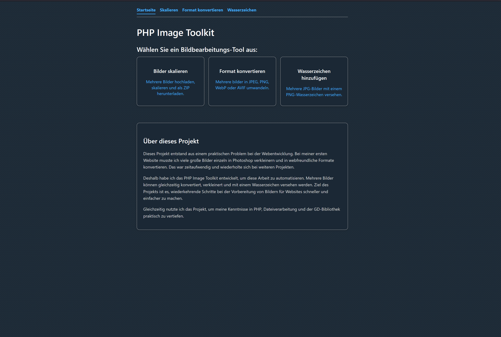
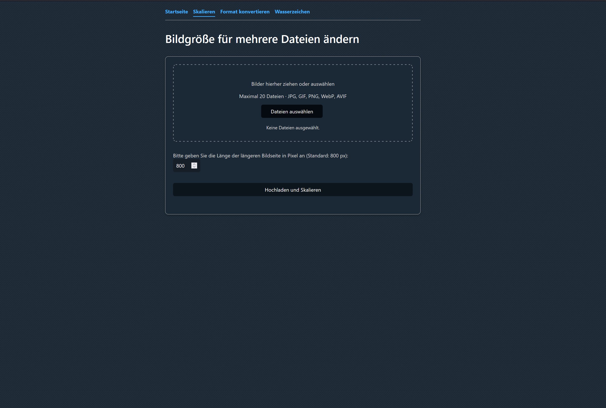
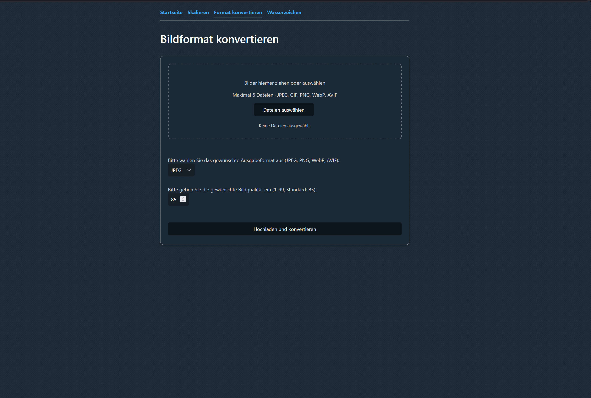
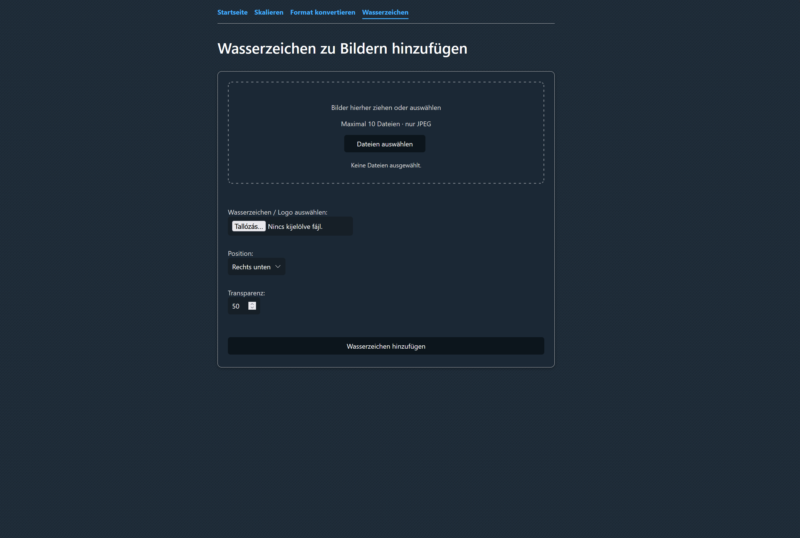

# PHP Image Toolkit

This README is available in English and German.  
Diese README ist auf Englisch und Deutsch verfügbar.

[English](#english) | [Deutsch](#deutsch)

---

## English

A PHP-based image processing toolkit for resizing, converting and watermarking images.

## Motivation

This project was created to solve a practical problem I encountered while building websites.

When working on my first website, I had to resize and convert many large images individually in Photoshop before using them on the website. This process was repetitive and time-consuming.

I created the PHP Image Toolkit to automate these tasks. The application allows multiple images to be resized, converted and watermarked in batches, making image preparation for web projects faster and more convenient.

The project also gave me the opportunity to deepen my knowledge of PHP, file handling, image processing with the GD library and frontend interaction with JavaScript.

## Features

* Batch image resizing while preserving aspect ratio
* Image format conversion to JPEG, PNG, WebP and AVIF
* PNG watermark support for multiple JPG images
* Configurable image quality
* Configurable watermark position and opacity
* Reusable drag-and-drop file upload
* Browser preview of processed images
* ZIP download of processed images
* MIME type validation using PHP fileinfo
* File size validation
* Image dimension and pixel-count limits
* Automatic cleanup after ZIP download
* Automatic cleanup of abandoned batch directories
* Randomized batch directories for temporary files

## Technologies Used

* PHP
* JavaScript
* HTML5
* CSS3
* PHP GD Library
* PHP ZipArchive
* PHP Fileinfo
* Water.css
* XAMPP
* Git / GitHub

## Files

* index.php – start page and navigation
* resize.php – resize multiple images
* convert.php – convert images to another format
* watermark.php – add a PNG watermark to JPG images
* download_zip.php – ZIP download and cleanup
* js/dropzone.js - reusable drag-and-drop file upload component
* includes/ – configuration, validation, image, upload, filename, ZIP and batch helper functions
* css/ – custom styling

## Main Functions

The project currently contains three image tools:

* Image Resizing – resize multiple images while keeping the aspect ratio
* Format Conversion – convert images to JPEG, PNG, WebP or AVIF
* Watermarking – add a PNG watermark to multiple JPG images

## Validation and File Handling

Uploaded files are validated on the server before processing.

The application checks:

* upload errors
* maximum file size
* MIME type using PHP fileinfo
* whether the uploaded file is a valid image
* maximum image dimensions
* maximum total pixel count

Temporary files are stored in randomly generated batch directories and are automatically removed after download or when they become outdated.

## Current Status

The application is fully functional and includes three image-processing tools: resizing, format conversion and watermarking.

The current version supports batch processing, reusable drag-and-drop uploads, server-side file validation, image dimension limits, ZIP downloads and automatic cleanup of temporary batch directories.

A live demo is available for testing the application.

## Planned Improvements

* CSRF protection
* Support for PNG and WebP images in the watermark tool
* Text watermark option
* Automated tests
* Additional image-processing options

## Installation

1. Clone the repository:

   ```bash
   git clone https://github.com/laci528-creator/PHP-Image-Toolkit.git
   ```

2. Move the project into your XAMPP htdocs directory.
3. Make sure the following PHP extensions are enabled:
    * GD
    * ZipArchive
    * fileinfo
4. Start Apache.
5. Open the project in your browser.

## Screenshots

### Start Page



### Batch Image Resizing



### Format Conversion



### Watermark Tool



## Live Demo

A live version of the PHP Image Toolkit is available here:

[Open Live Demo](https://php-image-toolkit.infinityfreeapp.com/)

## Developer

László Haraszti

## Note

This project was created for learning and portfolio purposes. The core functionality is complete, while additional features may be added in future versions.

---

## Deutsch

# PHP Image Toolkit

Ein PHP-basiertes Toolkit zur Bildverarbeitung, mit dem Bilder skaliert, konvertiert und mit Wasserzeichen versehen werden können.

## Motivation

Dieses Projekt entstand aus einem praktischen Problem, auf das ich bei der Entwicklung von Websites gestoßen bin.

Bei meiner ersten Website musste ich viele große Bilder einzeln in Photoshop verkleinern und konvertieren, bevor ich sie auf der Website verwenden konnte. Dieser Vorgang war zeitaufwendig und wiederholte sich bei weiteren Projekten.

Deshalb habe ich das PHP Image Toolkit entwickelt, um diese Aufgaben zu automatisieren. Mit der Anwendung können mehrere Bilder stapelweise skaliert, konvertiert und mit Wasserzeichen versehen werden. Dadurch wird die Vorbereitung von Bildern für Webprojekte schneller und komfortabler.

Gleichzeitig bot mir das Projekt die Möglichkeit, meine Kenntnisse in PHP, Dateiverarbeitung, Bildbearbeitung mit der GD-Bibliothek und der Frontend-Interaktion mit JavaScript weiter zu vertiefen.

## Funktionen

* Stapelweises Skalieren mehrerer Bilder unter Beibehaltung des Seitenverhältnisses
* Konvertierung von Bildern in JPEG, PNG, WebP und AVIF
* Hinzufügen eines PNG-Wasserzeichens zu mehreren JPG-Bildern
* Einstellbare Bildqualität bei der Konvertierung
* Einstellbare Position und Transparenz des Wasserzeichens
* Wiederverwendbarer Drag-and-drop-Dateiupload
* Vorschau der verarbeiteten Bilder im Browser
* Download der verarbeiteten Bilder als ZIP-Datei
* MIME-Typ-Validierung mit PHP Fileinfo
* Überprüfung der Dateigröße
* Begrenzung der Bildabmessungen und der maximalen Pixelanzahl
* Automatische Bereinigung nach dem ZIP-Download
* Automatische Bereinigung nicht mehr benötigter Batch-Verzeichnisse
* Zufällig generierte Batch-Verzeichnisse für temporäre Dateien

## Verwendete Technologien

* PHP
* JavaScript
* HTML5
* CSS3
* PHP GD Library
* PHP ZipArchive
* PHP Fileinfo
* Water.css
* XAMPP
* Git / GitHub

## Dateien

* `index.php` – Startseite und Navigation
* `resize.php` – mehrere Bilder skalieren
* `convert.php` – Bilder in ein anderes Format konvertieren
* `watermark.php` – ein PNG-Wasserzeichen zu JPG-Bildern hinzufügen
* `download_zip.php` – ZIP-Download und Bereinigung
* `js/dropzone.js` – wiederverwendbare Drag-and-drop-Dateiupload-Komponente
* `includes/` – Konfiguration sowie Hilfsfunktionen für Validierung, Bildverarbeitung, Uploads, Dateinamen, ZIP-Dateien und Batch-Verzeichnisse
* `css/` – eigene CSS-Anpassungen

## Hauptfunktionen

Das Projekt enthält derzeit drei Werkzeuge zur Bildverarbeitung:

* Bilder skalieren – mehrere Bilder unter Beibehaltung des Seitenverhältnisses skalieren
* Bildformat konvertieren – Bilder in JPEG, PNG, WebP oder AVIF konvertieren
* Wasserzeichen hinzufügen – ein PNG-Wasserzeichen zu mehreren JPG-Bildern hinzufügen

## Validierung und Dateiverarbeitung

Hochgeladene Dateien werden vor der Verarbeitung serverseitig überprüft.

Die Anwendung überprüft:

* Upload-Fehler
* maximale Dateigröße
* MIME-Typ mit PHP Fileinfo
* ob es sich bei der hochgeladenen Datei um ein gültiges Bild handelt
* maximale Bildabmessungen
* maximale Gesamtanzahl der Pixel

Temporäre Dateien werden in zufällig generierten Batch-Verzeichnissen gespeichert und nach dem Download oder nach Ablauf einer bestimmten Zeit automatisch entfernt.

## Aktueller Stand

Die Anwendung ist vollständig funktionsfähig und enthält drei Werkzeuge zur Bildverarbeitung: Skalierung, Formatkonvertierung und Wasserzeichen.

Die aktuelle Version unterstützt Stapelverarbeitung, wiederverwendbaren Drag-and-drop-Upload, serverseitige Dateivalidierung, Begrenzung der Bildabmessungen und Pixelanzahl, ZIP-Downloads sowie die automatische Bereinigung temporärer Batch-Verzeichnisse.

Eine Live-Demo steht zum Testen der Anwendung zur Verfügung.

## Geplante Weiterentwicklungen

* CSRF-Schutz
* Unterstützung von PNG- und WebP-Bildern im Wasserzeichen-Tool
* Text-Wasserzeichen
* Automatisierte Tests
* Zusätzliche Bildbearbeitungsfunktionen

## Installation

1. Repository klonen:

   ```bash
   git clone https://github.com/laci528-creator/PHP-Image-Toolkit.git
   ```

2. Das Projekt in das `htdocs`-Verzeichnis von XAMPP verschieben.

3. Sicherstellen, dass die folgenden PHP-Erweiterungen aktiviert sind:

   * GD
   * ZipArchive
   * Fileinfo

4. Apache starten.

5. Das Projekt im Browser öffnen.

## Screenshots

### Startseite


### Stapelweises Skalieren von Bildern


### Formatkonvertierung


### Wasserzeichen-Tool


## Live-Demo

Eine Live-Version des PHP Image Toolkits ist hier verfügbar:

[Live-Demo öffnen](https://php-image-toolkit.infinityfreeapp.com/)

## Entwickler

László Haraszti

## Hinweis

Dieses Projekt wurde zu Lern- und Portfoliozwecken erstellt. Die Kernfunktionen sind vollständig umgesetzt, weitere Funktionen können jedoch in zukünftigen Versionen ergänzt werden.